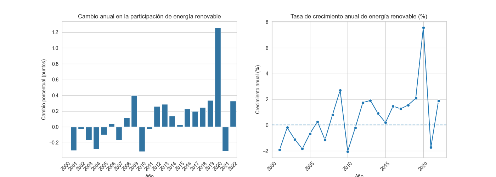
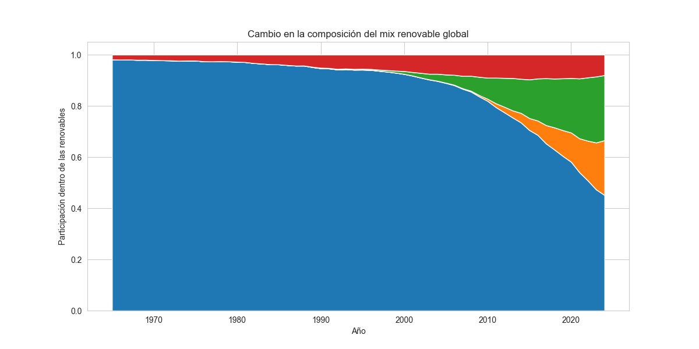

# ⚡ La Transformación Energética

     


## Evolución Global y Nuevos Protagonistas de las Renovables (2000-2024)

> **Un análisis exploratorio de datos sobre la transición energética mundial**  

---

## 🎯 Objetivo del Proyecto

Este proyecto analiza la evolución de las energías renovables a nivel global en dos dimensiones complementarias:

- **Parte 1:** ¿Crece la energía renovable? → **Análisis macro de tendencias globales**
- **Parte 2:** ¿Quién impulsa ese crecimiento? → **Análisis estructural por tecnología**

El objetivo es responder si la transición energética es real, a qué ritmo avanza y qué tecnologías están liderando este cambio.

---

## 📊 Datasets Utilizados

### Parte 1: Evolución Global
**Fuente:** Our World in Data  
**Dataset:** *Share of final energy use that comes from renewable sources*  
**Periodo:** 2000-2022  
**URL:** [Our World in Data - Renewable Share](https://archive.ourworldindata.org/20260130-180113/grapher/share-of-final-energy-consumption-from-renewable-sources.html)

**Columnas clave:**
- `Year`: Año de medición
- `Entity`: País/región (filtrado por "World")
- `Renewables (% equivalent primary energy)`: Participación renovable en consumo final

### Parte 2: Análisis por Tecnología
**Fuente:** Our World in Data  
**Dataset:** *Modern renewable energy consumption*  
**Periodo:** 1965-2024  
**URL:** [Our World in Data - Modern Renewables](https://ourworldindata.org/grapher/modern-renewable-energy-consumption)

**Columnas clave:**
- `Year`: Año de medición
- `Entity`: País/región (filtrado por "World")
- `Hydropower`: Producción hidroeléctrica (TWh)
- `Solar`: Producción solar (TWh)
- `Wind`: Producción eólica (TWh)
- `Other renewables`: Otras fuentes renovables (TWh)

---

## 🔧 Tecnologías Utilizadas

### Lenguaje y Entorno
- **Python 3.13.5**
- **Jupyter Notebook** (análisis interactivo)
- **VSCode** (editor de código)
- **UV** (gestor de paquetes)

### Librerías Principales
```python
pandas          # Manipulación de datos
matplotlib      # Visualización base
seaborn         # Visualizaciones estadísticas avanzadas
```

---

## 📁 Estructura del Proyecto

```
proyecto-energia-renovable/
│
├── README.md                          # Este archivo
├── EDA.ipynb  # Notebook principal con análisis
│
├── dataset/                           # Datos crudos
│   ├── share-of-final-energy-consumption-from-renewable-sources.csv
│   └── modern-renewable-energy-consumption.csv
│
└── assets/                            # Gráficos generados
    ├── evolution_global.png
    ├── annual_change.png
    ├── growth_rate.png
    ├── AnnualChange_vs_GrowthRAte.png
    ├── evolution_hydropower.png
    ├── evolution_solar.png
    ├── evolution_wind.png
    ├── technology_comparison.png
    ├── Other_renewables.png
    └── renewable_mix.png
```

---

## 📈 Análisis Realizado

### Parte 1: Evolución Global de la Energía Renovable

**Pregunta central:** *¿Está creciendo realmente la energía renovable a nivel mundial?*

#### Metodología
1. Filtrado de datos globales (`Entity == "World"`)
2. Análisis de la serie temporal 2000-2022
3. Cálculo de cambios anuales y tasas de crecimiento
4. Identificación de puntos de inflexión y periodos críticos

#### Gráficos clave
- **Evolución temporal:** Tendencia de participación renovable (%)
- **Cambio anual:** Incremento/decremento en puntos porcentuales
- **Tasa de crecimiento:** Velocidad de la transición energética



#### Hallazgos principales
✅ **Crecimiento confirmado:** La participación renovable pasó de ~15.7% (2000) a ~17.9% (2022)  
⚠️ **Crecimiento lento:** Solo +2.2 puntos porcentuales en 22 años  
📊 **No lineal:** Largos periodos de estancamiento y aceleraciones puntuales  
🔴 **Año 2020:** Evento atípico (+1.26 pp) seguido de corrección parcial

---

### Parte 2: Análisis Estructural por Tecnología

**Pregunta central:** *¿Qué tecnologías están impulsando el crecimiento renovable?*

#### Metodología
1. Análisis individual de cada tecnología (Hydro, Solar, Wind, Others)
2. Evolución temporal por fuente (1965-2024)
3. Comparación de tasas de crecimiento entre tecnologías
4. Cálculo de participación relativa en el mix renovable
5. Identificación de cambios estructurales

#### Gráficos clave
- **Evolución individual:** Trayectoria de cada tecnología
- **Comparación multi-tecnología:** Escalas y ritmos diferenciados
- **Composición del mix:** Cambio en pesos relativos



#### Hallazgos principales
🏔️ **Hidroelectricidad:** Base histórica dominante, crecimiento estable pero maduro  
☀️ **Solar:** Aparición tardía, crecimiento exponencial en últimas 2 décadas  
💨 **Eólica:** Expansión acelerada y sostenida desde los 2000  
📉 **Cambio estructural:** Hidroelectricidad pierde peso relativo a favor de solar y eólica

---

## 💡 Insights Clave del Proyecto

### 🎯 Insight 1: La transición es real pero gradual
El crecimiento de la energía renovable es sostenido pero lento. Un incremento de ~2.2 puntos porcentuales en 22 años evidencia una tendencia positiva, aunque de baja intensidad a lo largo del tiempo.

### 🎯 Insight 2: El año 2020 no refleja un cambio estructural
El aumento excepcional observado en 2020 (+7.58%) coincide con el contexto de la pandemia, caracterizado por una reducción del consumo energético fósil. La corrección posterior sugiere que este pico no representa un cambio estructural en la transición energética.

### 🎯 Insight 3: Solar y eólica lideran la nueva era renovable
Aunque la hidroelectricidad continúa siendo la principal fuente renovable en términos absolutos, el crecimiento reciente del sector está impulsado mayoritariamente por la energía solar y eólica. Esto indica un cambio progresivo en la estructura histórica del mix renovable.

### 🎯 Insight 4: El crecimiento no es homogéneo
Las distintas tecnologías renovables presentas trayectorias distintas:
- Hidroelectricidad: crecimiento estable, lineal y predecible
- Solar/eólica: crecimiento acelerado de carácter exponencial.
- Otras renovables: crecimiento moderado con rol complementario

---

## 📋 Conclusiones

### Visión Macro


La transición energética global está en marcha, pero su velocidad histórica es limitada. El ritmo observado parece no ser compatible con los horizontes temporales asociados a los compromisos climáticos internacionales, como los acuerdos de París (2015) y Glasgow (2021).

El análisis temporal muestra periodos prolongados de estancamiento (2000-2010) seguidos de una aceleración reciente (2015-2022), lo que sugiere una fuente dependencia de factores externos como políticas públicas, inversiones tecnológicas y contexto económico.

### Análisis Estructural

El mix de energías ha experimentado una transformación estructural: de un modelo históricamente dominado por la hidroelectricidad hacia un sistema más diversificado, donde la energía solar y eólica han pasado de ser fuentes maginales a motores principales de crecimiento.

Las elevadas tasas de crecimiento de estas tecnologías emergentes indican un potencial de aceleración futura de la transición energética, siempre condicionado a factores de continuidad de incentivos, inversión e innovación tecnológica.

---

## ⚠️ Limitaciones del Análisis

El análisis realizado tiene las siguientes restricciones que deben considerarse al interpretar los resultados:

- **Datos agregados globales:** No se analizan diferencias regionales ni por país
- **Enfoque descriptivo:** Se identifican tendencias, pero no se analizan causas (políticas, costos, clima)
- **Sin comparación con energías fósiles:** El análisis se centra exclusivamente en renovables
- **Análisis temporal:** No se incluyen proyecciones ni modelos predictivos

---

## 🔮 Mejoras Futuras

### Extensiones de Análisis
- [ ] **Análisis regional:** Comparar Europa vs Asia vs América en adopción renovable.
- [ ] **Análisis económico:** Correlación entre PIB, costos de tecnología y adopción renovable.
- [ ] **Modelado predictivo:** Proyecciones de crecimiento con modelos de series temporales.
- [ ] **Análisis exhaustivo de políticas:** Impacto de acuerdos climáticos (París 2015, Glasgow 2021) en tasas de adopción

### Mejoras Técnicas
- [ ] **Visualización interactiva:** Implementar dashboards con Plotly o Streamlit
- [ ] **Mapas geográficos:** Visualización por país con `geopandas` y `folium`
- [ ] **Automatización:** Pipeline ETL para actualización automática de datos

---

## 📚 Referencias

- **Our World in Data** - *Share of final energy consumption from renewable sources*  
  https://ourworldindata.org/renewable-energy

- **Our World in Data** - *Modern renewable energy consumption*  
  https://ourworldindata.org/grapher/modern-renewable-energy-consumption

- **IRENA** (International Renewable Energy Agency) - *Global renewable capacity statistics*
  https://www.irena.org/

- **IEA** (International Energy Agency) - *Renewables 2024 Report*
  https://www.iea.org/

---

## 📄 Licencia

Este proyecto es de uso académico y está basado en datos públicos de Our World in Data.

---

## 👤 Autor

**Desarrollador:** Jonathan Brasales

**Proyecto:** Project EDA: Exploratory Data Analysis

**Contacto:** 
- 💼 LinkedIn: [jbrasales](https://www.linkedin.com/in/jbrasales/)
- 🐙 GitHub: [@JonnyBP](https://github.com/JonnyBP)

**Tablero del Proyecto:** [GitHub Projects](https://github.com/orgs/Bootcamp-IA-P6/projects/23)

---

<div align="center">
  
**⭐ Si este proyecto te resulta útil, considera darle una estrella ⭐**

Hecho con ❤️ usando Python y Jupyter Notebook

</div>


